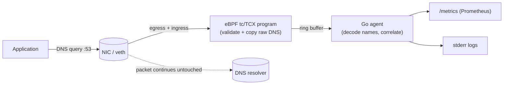

# dnsmon

A passive **eBPF DNS monitor** — think "Cilium's DNS visibility, minus the proxy."

It attaches passive `tc`/TCX programs to a network interface, copies DNS packets
into a ring buffer, decodes them in Go userspace, and exposes Prometheus metrics.

## Why this exists (the Cilium angle)

Cilium's DNS-based network policy (`toFQDNs`) does **not** parse DNS in eBPF.
From the [Cilium docs](https://docs.cilium.io/en/stable/security/dns/):

> "By default, Cilium uses an **in-agent DNS proxy** for DNS policy enforcement."

The split of responsibilities in Cilium is:

| Layer | Component | Job |
| --- | --- | --- |
| Interception | eBPF datapath (tc + tproxy) | Redirect port-53 traffic to the proxy |
| DNS parsing / visibility / enforcement | **userspace DNS proxy** (in the agent) | Decode query + response, learn domain→IP, update policy, forward |

Cilium parses in a proxy because fully decoding DNS inside the eBPF verifier is
hard (compression pointers, EDNS0, TCP reassembly, bounded loops) — and to
*block* a lookup you have to sit inline anyway. The cost is that the proxy is in
the data path (an extra hop + latency) and only runs when policy/visibility is on.

**dnsmon takes the opposite trade-off.** It is observe-only, so it can be
passive:

- The **kernel** program only validates "this is DNS-over-UDP" and copies the raw
  bytes to a ring buffer. It returns `TC_ACT_OK` and never touches the packet.
- **Userspace (Go)** does the hard part — name decompression — where loops and
  pointers are free.

Result: near-zero added latency, no proxy, not in the enforcement path. The
trade-off is that dnsmon *observes* but does not *block* (see Roadmap). This is
the same design space as Inspektor Gadget's `trace dns` and Pixie.

## Architecture



## Requirements

- Linux kernel **>= 6.6** (for TCX attach) with BTF (`/sys/kernel/btf/vmlinux`).
- `clang`, `llvm`, `libbpf-dev`, Go **>= 1.22**.
- Root (to load BPF and attach to tc).

On macOS, either use the bundled Lima VM (bare-host workflow) or the
[kind cluster workflow](#run-on-a-kind-cluster-docker) below — both run Linux
with a recent kernel.

## Quick start (macOS via Lima)

```bash
brew install lima            # if needed
limactl start --name=dnsmon ./lima.yaml
limactl shell dnsmon

cd /Users/$USER/ebpf-dns-monitor
go mod tidy                  # fetch deps, write go.sum
make run                     # generate + build + run on the default iface
```

In another shell, generate some traffic and scrape metrics:

```bash
limactl shell dnsmon -- bash -lc 'dig +short github.com; dig AAAA cloudflare.com'
curl -s localhost:2112/metrics | grep dnsmon_
```

Sample log output (`-v`):

```
QUERY  10.0.2.15:41234 -> 10.0.2.3:53 id=0x1a2b A     github.com
RESP   10.0.2.3:53 -> 10.0.2.15:41234 id=0x1a2b NOERROR  github.com [140.82.121.4] (12.34ms)
```

## Run on a kind cluster (Docker)

This is the natural way to exercise the DaemonSet path. Understand the trade-offs
first:

- **kind nodes share one kernel** (the Docker VM's), so this validates
  *packaging, privileges, and deployment* — not true multi-node kernels.
- **The pod is privileged + `hostNetwork`** so it can attach TCX to the node's
  interface and observe DNS egressing the node.
- **Kernel must be >= 6.6** (TCX) and >= 5.8 (ring buffer). Check the Docker VM
  kernel: `docker run --rm alpine uname -r`. Recent Docker Desktop / Colima are
  fine; older ones need the clsact fallback (roadmap).
- **BTF is *not* required** — the program does no CO-RE (no `vmlinux.h`,
  no `BPF_CORE_READ`), so the classic "Docker Desktop has no
  `/sys/kernel/btf/vmlinux`" problem does not apply. The image build also
  compiles the eBPF object, so you need neither clang nor Go on the host.

```bash
make kind-up        # create the cluster
make deploy         # build image -> load into kind -> apply the DaemonSet
make logs           # follow DNS events

# Generate DNS that leaves the node. kind nodes resolve via Docker's embedded
# DNS at 127.0.0.11 (loopback -> never on eth0), so point the lookup at an
# explicit external resolver to force the packet out eth0 where dnsmon watches:
kubectl run dnsprobe --image=busybox --restart=Never -- sh -c "sleep 3600"
kubectl exec dnsprobe -- nslookup github.com 1.1.1.1

# Scrape metrics from a node:
POD=$(kubectl -n dnsmon get pod -l app=dnsmon -o name | head -1)
kubectl -n dnsmon port-forward "$POD" 2112:2112 &
curl -s localhost:2112/metrics | grep dnsmon_
```

The DaemonSet attaches to the node's default-route interface (`eth0` in kind), so
it sees DNS **egressing the node** toward external resolvers. Cluster-internal
DNS (pod→CoreDNS) and the node's own `127.0.0.11` lookups ride the CNI
bridge/veths and loopback respectively; capturing those is the multi-interface
roadmap item. Tear down with `make kind-down`.

## Metrics

| Metric | Type | Labels |
| --- | --- | --- |
| `dnsmon_queries_total` | counter | `qtype` |
| `dnsmon_responses_total` | counter | `rcode` |
| `dnsmon_query_duration_seconds` | histogram | — |
| `dnsmon_events_total` | counter | — |
| `dnsmon_parse_errors_total` | counter | — |
| `dnsmon_queries_by_domain_total` | counter | `domain`, `qtype` (only with `-per-domain-metrics`) |

## Flags

| Flag | Default | Description |
| --- | --- | --- |
| `-iface` | auto-detect | Interface to attach to |
| `-metrics-addr` | `:2112` | Prometheus listen address |
| `-v` | `false` | Log every DNS event |
| `-per-domain-metrics` | `false` | Per-domain counters (high cardinality) |

## Known limitations (v1)

- **UDP only.** TCP DNS (and its 2-byte length prefix / multi-segment
  reassembly) is not decoded yet.
- **IPv4 only** on the wire (it still records AAAA answer records).
- **Single interface.** Local stub resolvers (e.g. `systemd-resolved` at
  `127.0.0.53`) live on `lo`; run a second instance with `-iface lo` to see them.
- **No VLAN (802.1Q)** parsing.
- **Observe-only** — no blocking.

## Roadmap

- IPv6 + TCP DNS parsing.
- Process attribution (PID/comm) via a `cgroup/connect` hook filling a
  socket-cookie→PID map.
- Optional inline enforcement (allow/deny list) — moving toward `toFQDN`-style
  policy, which is where a proxy or an inline verdict becomes necessary.
- Pod metadata enrichment for the Kubernetes DaemonSet (see "Run on a kind
  cluster" — the DaemonSet itself is already included).
- Legacy `clsact` attach fallback for kernels older than 6.6.

## Layout

```
bpf/dns.bpf.c            eBPF program (tc/TCX): validate + copy raw DNS
gen.go                   go:generate directive for bpf2go
main.go                  loader, TCX attach, ring buffer loop, metrics server
internal/dns/parse.go    DNS wire-format decoder (name decompression)
internal/metrics/        Prometheus collectors
Dockerfile               multi-stage build (compiles eBPF + static binary)
deploy/kind-config.yaml  kind cluster definition
deploy/daemonset.yaml    privileged, hostNetwork DaemonSet + metrics Service
lima.yaml                Linux VM for macOS (bare-host workflow)
Makefile                 deps / generate / build / run / docker / kind
```
